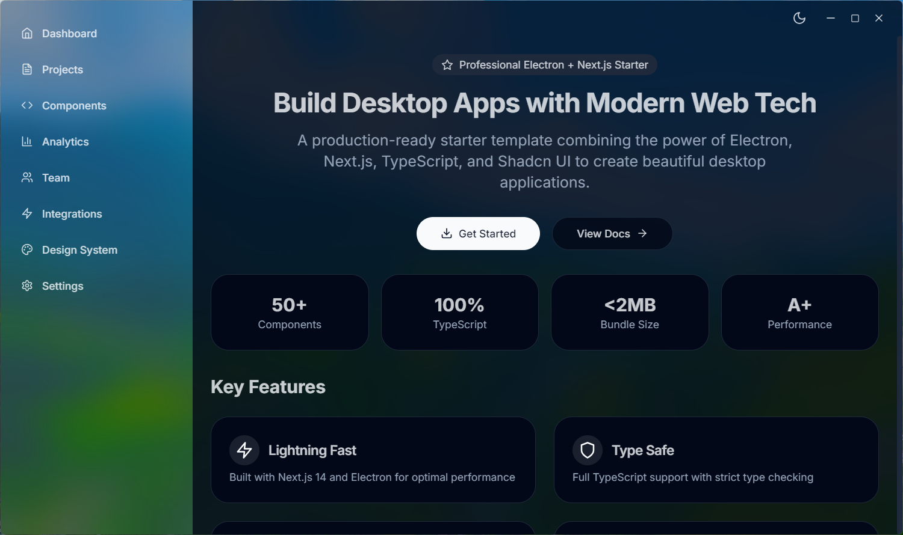

# SamCux Electron + NextJS

A professional starter template combining Electron and Next.js with modern UI components and TypeScript support.



## 🚀 Features

- 🌐 **Electron**: Cross-platform desktop application framework
- ⚡ **Next.js 14**: React framework with App Router
- 🔒 **TypeScript**: Type-safe development
- 🎨 **Tailwind CSS**: Utility-first CSS framework
- 🎯 **Shadcn/ui**: Beautiful and accessible UI components
- 🌓 **Theme Support**: Dark/light mode with next-themes
- 🎛️ **Custom Window Controls**: Frameless window with custom controls
- 🖼️ **Icon Integration**: Professional app icons across all platforms

## 📋 Prerequisites

- Node.js 18+
- npm or yarn

## 🛠️ Installation

```bash
# Clone the repository
git clone <your-repo-url>
cd SamCux-Electron-NextJS

# Install dependencies
npm install

# Start development server
npm run dev
```

## 📦 Scripts

- `npm run dev` - Start development mode (Next.js + Electron)
- `npm run build` - Build and package the application
- `npm run start` - Start Next.js production server
- `npm run lint` - Run ESLint

## 🏗️ Build & Distribution

The app is configured to build for multiple platforms:

- **Windows**: `.exe`, portable, and `.zip`
- **macOS**: `.dmg`, `.zip`, and directory
- **Linux**: `.appimage`, `.zip`, and directory

```bash
npm run build
```

## 🎨 Icons

App icons are located in `/resources/` and automatically integrated:

- `icon.png` - Linux and window icon
- `icon.ico` - Windows app icon
- `icon.icns` - macOS app icon

## 🔧 Project Structure

```
├── app/                 # Next.js App Router
├── components/          # React components
│   ├── layout/         # Layout components
│   ├── providers/      # Context providers
│   └── ui/             # UI components
├── lib/                # Utilities and configurations
├── main/               # Electron main process
├── public/             # Static assets
├── resources/          # App icons and resources
├── styles/             # Global styles
└── types/              # TypeScript definitions
```

## 📄 License

This project is private and proprietary.

## ��‍💻 Author

SamCux
# SamCux-Electron-Nextjs-Starter
